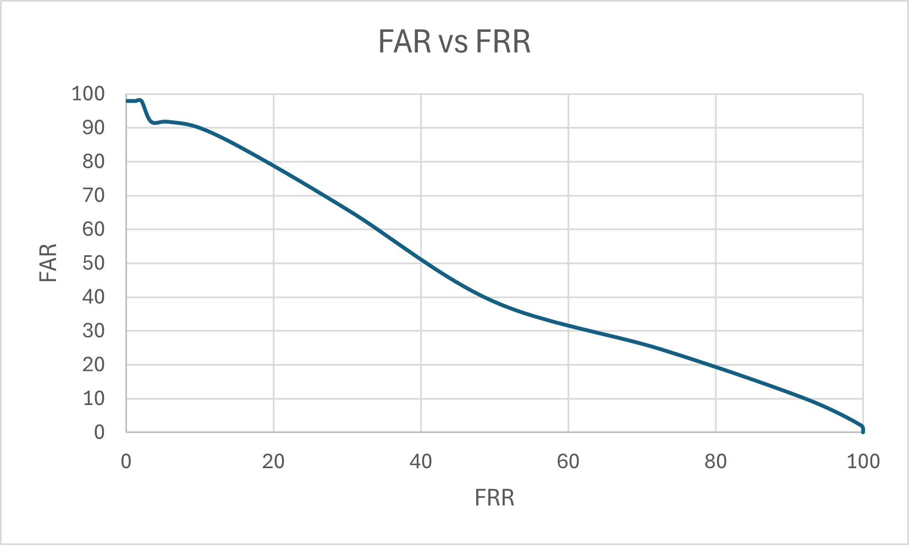

# End-to-End Fingerprint Recognition System

This project is a complete fingerprint recognition system built from the ground up in C++ using the OpenCV library. It implements the entire biometric pipeline, from initial image processing and feature extraction to a robust minutiae-based matching algorithm. The system is capable of identifying individuals by comparing a probe fingerprint against a database of known prints and includes a comprehensive testing harness for performance evaluation.

## Features

* **Image Processing:** Implements essential preprocessing steps, including a block-based binarization algorithm to convert grayscale fingerprints into a high-contrast black and white format.
* **Ridge Thinning:** Utilizes a morphological thinning algorithm to create a one-pixel-wide "skeleton" of the fingerprint ridges, which is essential for accurate feature extraction.
* **Minutiae Feature Extraction:** Scans the thinned image to identify and extract key minutiae points (ridge endings and bifurcations). The algorithm accurately calculates the position (x, y) and orientation (angle) of each minutia.
* **False Minutiae Removal:** A filtering step is applied to clean the extracted feature set by removing spurious minutiae caused by noise, such as those too close to the image border or to each other.
* **Alignment-Based Matching:** Employs a robust brute-force matching algorithm that tests all possible alignments between two sets of minutiae. It calculates a similarity score based on the optimal alignment that produces the highest number of corresponding minutiae pairs.
* **Performance Evaluation:** Includes a separate testing executable that automatically calculates and reports key biometric performance metrics, including the **False Acceptance Rate (FAR)**, **False Rejection Rate (FRR)**, and **Top-1 Identification Accuracy**.

## How It Works

The system follows a standard pipeline for minutiae-based fingerprint recognition:

1.  **Binarization:** A grayscale fingerprint image is converted into a binary image. The algorithm divides the image into small blocks and calculates a local threshold for each, effectively separating ridges from valleys even with varying lighting.
2.  **Thinning:** The binary image is thinned until all ridges are a single pixel wide. This skeletonized image preserves the topological structure of the fingerprint.
3.  **Minutiae Extraction:** The program scans the thinned skeleton and uses the "Crossing Number" method to identify minutiae. The orientation of each minutia is calculated by tracing the local ridge flow for a short distance.
4.  **Filtering:** The extracted minutiae set is filtered to remove likely false points, improving the signal-to-noise ratio for the matching stage.
5.  **Matching & Scoring:** To compare two fingerprints, the system iterates through every possible pair of minutiae (one from each print) to act as an alignment anchor. For each alignment, it transforms one set of points and counts the number of pairs that match in position, orientation, and type. The alignment that produces the highest number of matches yields the final similarity score.

## How to Build and Run

This project uses CMake and requires a C++17 compiler and OpenCV.

### Prerequisites

* A C++ Compiler (MSVC, GCC, Clang)
* CMake (version 3.10 or later)
* OpenCV (version 4.x recommended)

### Setup

1.  **OpenCV:** Before building, you must set an environment variable named `OpenCV_DIR` that points to your OpenCV build directory (e.g., `C:/opencv/build` or `/usr/local/share/OpenCV`).
2.  **Dataset:** Optionally, you can download a preprocessed test dataset from [**here**](https://drive.google.com/file/d/1h84VSyqC7arbd3Kb4Yc9DvpkTuxec9go/view?usp=sharing). Unzip the contents into a folder and update the directory path in main & testMain to that folder.

### Build Instructions

1.  **Clone the repository:**
    ```bash
    git clone [https://github.com/jamisonHB/Fingerprint-Recognition.git](https://github.com/JamisonHB/Fingerprint-Recognition.git)
    cd FingerprintRecognition
    ```
2.  **Configure with CMake:**
    ```bash
    mkdir build
    cd build
    cmake ..
    ```
3.  **Compile the project:**
    ```bash
    cmake --build . --config Release
    ```

### Running the Programs

Two executables will be created in the `build/Release` directory:

* **`FingerprintRecognition`**: A simple demonstration that matches a single probe print against the database.
* **`FingerprintRecognitionTest`**: The full testing harness that calculates and prints performance statistics.

To run them from the `build` directory:
```bash
# Run the simple demo
./Release/FingerprintRecognition.exe

# Run the full test suite
./Release/FingerprintRecognitionTest.exe
```

## Results and Performance

The system's performance was evaluated on a dataset of 98 manually processed fingerprint images (49 pairs). The following Detection Error Trade-off (DET) curve was generated by testing thresholds from 0.0 to 0.05.



* **Equal Error Rate (EER):** The point at which FAR equals FRR was found to be approximately **~45%**.
* **Top-1 Identification Accuracy:** When identifying a probe against the entire database, the system correctly ranked the true match as the top candidate **3.06%** of the time.

## Limitations and Future Work

* **Sensitivity to Image Quality:** As documented, the current processing pipeline is designed for a pre-cleaned dataset. Its performance degrades on raw, noisy images containing significant background textures, artifacts, or poor contrast.
* **Brute-Force Matching Speed:** The matching algorithm is computationally intensive (`O(n² * m²)`), and while effective, its runtime can be long for large minutiae sets.

Future work could address these limitations:

* **Advanced Preprocessing:** Integrate a more robust, multi-stage preprocessing pipeline (e.g., using Gabor filters for enhancement and FFT for noise removal) to allow the system to handle raw, real-world images.
* **Optimized Matching Algorithm:** Replace the brute-force matcher with a more efficient algorithm, such as one based on the Hough Transform, to dramatically reduce matching time.

## Additional Information
* The current implementation is a proof of concept and does not include advanced features like image enhancement, noise reduction, or real-time processing.
* Issues with matching performance on noisy images are acknowledged, and the system is not yet suitable for production use without further refinement.
* Future improvements will address these limitations and potentially integrate machine learning techniques for better feature extraction and matching.

## License
This project is licensed under the MIT License. See the [LICENSE](LICENSE.txt) file for details.
